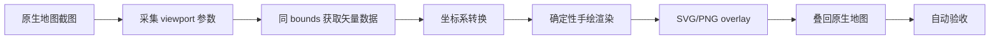

# 接入真实地图的工作流

这份文档说明如何把当前 MVP 接到真实业务地图里。

## 总体链路



## 第一步：截图时必须记录的参数

截图和渲染必须使用同一组相机参数：

```json
{
  "width": 1200,
  "height": 800,
  "devicePixelRatio": 2,
  "center": [116.397389, 39.908722],
  "zoom": 16,
  "tileSize": 512,
  "coordinateSystem": "GCJ02",
  "bearing": 0,
  "pitch": 0
}
```

注意事项：

- `width` / `height` 必须是截图实际像素。如果浏览器 CSS 宽高是 `600x400`，`devicePixelRatio=2`，截图通常是 `1200x800`。
- 国内高德、腾讯、百度底图通常不是 WGS84。坐标系不一致时，哪怕渲染逻辑完全正确，也会整体偏移。
- 当前 MVP 只支持 `bearing=0`、`pitch=0`。如果业务地图允许旋转/倾斜，截图前先锁定，或者后续改用地图引擎相机矩阵投影。

仓库里提供了浏览器端模板：[snippets/collect-viewport.js](/Users/lishaokai/Documents/guide-map/snippets/collect-viewport.js)。你可以把对应函数复制到页面控制台，或者接入业务代码，在截图同一时刻打印 viewport。

如果你暂时不知道当前页面用的是哪种地图 SDK，可以在控制台试这些线索：

```js
Boolean(window.AMap)       // 高德
Boolean(window.BMapGL)     // 百度 GL
Boolean(window.BMap)       // 百度
Boolean(window.maplibregl) // MapLibre
Boolean(window.mapboxgl)   // Mapbox
Boolean(window.L)          // Leaflet
```

## MapLibre / Mapbox 示例

```js
function collectMapLibreViewport(map, screenshotWidth, screenshotHeight) {
  const center = map.getCenter();

  return {
    width: screenshotWidth,
    height: screenshotHeight,
    devicePixelRatio: window.devicePixelRatio || 1,
    center: [center.lng, center.lat],
    zoom: map.getZoom(),
    tileSize: 512,
    coordinateSystem: "WGS84",
    bearing: map.getBearing(),
    pitch: map.getPitch()
  };
}
```

叠加 SVG：

```js
const manifest = await fetch("/output/example-overlay.json").then((r) => r.json());

map.addSource("handdrawn-overlay", {
  type: "image",
  url: "/output/example-handdrawn.svg",
  coordinates: [
    [manifest.overlay.bounds.west, manifest.overlay.bounds.north],
    [manifest.overlay.bounds.east, manifest.overlay.bounds.north],
    [manifest.overlay.bounds.east, manifest.overlay.bounds.south],
    [manifest.overlay.bounds.west, manifest.overlay.bounds.south]
  ]
});

map.addLayer({
  id: "handdrawn-overlay",
  type: "raster",
  source: "handdrawn-overlay",
  paint: {
    "raster-opacity": 1
  }
});
```

## Leaflet 示例

```js
function collectLeafletViewport(map, screenshotWidth, screenshotHeight) {
  const center = map.getCenter();

  return {
    width: screenshotWidth,
    height: screenshotHeight,
    devicePixelRatio: window.devicePixelRatio || 1,
    center: [center.lng, center.lat],
    zoom: map.getZoom(),
    tileSize: 256,
    coordinateSystem: "WGS84",
    bearing: 0,
    pitch: 0
  };
}
```

叠加 SVG：

```js
const manifest = await fetch("/output/example-overlay.json").then((r) => r.json());

L.imageOverlay("/output/example-handdrawn.svg", manifest.overlay.leafletBounds, {
  opacity: 1,
  interactive: false
}).addTo(map);
```

## 高德/腾讯/百度地图

建议策略：

- 截图、视口参数和 overlay 都使用同一个地图 SDK。
- 配置里的 `coordinateSystem` 设置为底图实际坐标系。
- 输入 GeoJSON 如果是 WGS84，需要先转换为 GCJ02 或 BD09。
- 百度地图通常使用 BD09。高德/腾讯常见是 GCJ02。

当前渲染器已经内置了 `WGS84`、`GCJ02`、`BD09` 的互转，生产中仍建议统一在数据入库阶段完成坐标系标准化，减少运行时不确定性。

## 矢量数据来源

为了 1:1 覆盖，优先级建议：

1. 自有测绘数据：最准，适合景区/园区。
2. 地图 SDK 或服务端矢量瓦片：适合道路、水系、绿地、建筑。
3. OSM/公开数据：适合原型验证，但国内数据覆盖和坐标系需要校验。
4. 截图识别/分割：只能作为兜底，不建议作为主链路。

当前仓库已经提供了 OSM/Overpass 抓取脚本：

```bash
npm run fetch:xixi
npm run render:xixi
npm run validate:xixi
```

这会按 [config/xixi-wetland.viewport.json](/Users/lishaokai/Documents/guide-map/config/xixi-wetland.viewport.json) 的视口范围拉取同范围矢量数据，输出 [data/xixi-wetland.osm.geojson](/Users/lishaokai/Documents/guide-map/data/xixi-wetland.osm.geojson)，再生成西溪湿地手绘 overlay。

## AI 应该放在哪

推荐 AI 参与这些内容：

- 纸张底纹。
- 水彩/铅笔/蜡笔风格纹理。
- 树、亭子、厕所、售票处等图标素材。
- 景区特色建筑的局部插画。

不推荐 AI 参与这些内容：

- 道路线形。
- 河流/湖泊边界。
- 建筑外轮廓。
- POI 锚点。
- 文字位置。

## 自动验收指标

建议从这几项开始：

- 生成图尺寸与截图尺寸完全一致。
- 关键 POI 像素坐标偏差小于 `1px`。
- 道路中心线平均偏差小于 `1-2px`。
- 水体/绿地/建筑 mask IoU 大于 `0.98`。
- 坐标系转换后不存在固定方向整体偏移。

当前 `npm run validate` 已经实现尺寸校验。后续可以继续加入 POI 锚点和 mask 校验。
